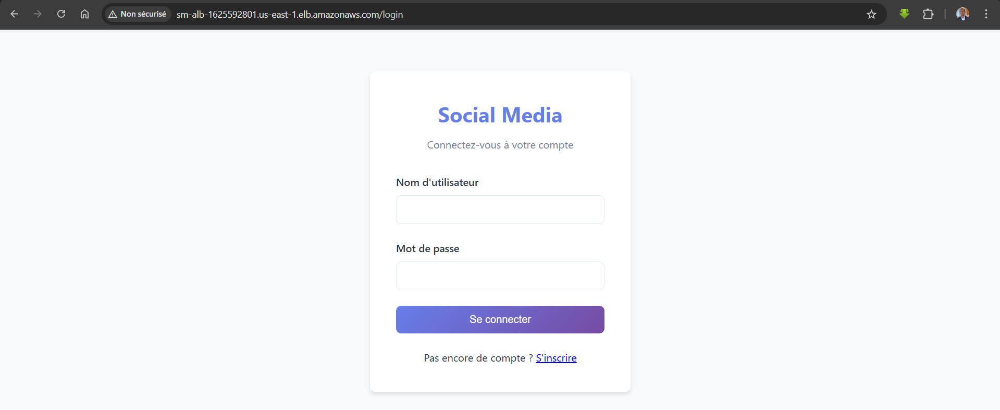

# Déploiement Spring MVC sur AWS (EC2 + ALB + RDS + S3 + Bastion)

Ce guide décrit le déploiement de l'application sur une infrastructure AWS sécurisée, avec les composants suivants :

- EC2 dans un VPC privé, accessible via un bastion
- ALB pour le routage et la scalabilité horizontale
- RDS (MySQL) pour la base de données
- S3 pour stocker les JAR de l'application
- Nginx comme reverse proxy devant Spring Boot (dans l'EC2)

## Prérequis
- Avoir un compte AWS, créer toutes les ressources défini dans le dossier terraform en appliqunt les commandes suivantes en se déplacant dans le dossier terraform
```bash
terraform init
terraform plan
terraform apply
```
- Bastion configuré pour accéder aux EC2 privées (SSH uniquement via bastion)
- EC2 Ubuntu dans le VPC privé avec SG autorisant uniquement le Bastion pour SSH
- ALB configuré dans le VPC, pointant vers les EC2 (ports 80/443) en passant par le proxy Nginx
- RDS MySQL dnas le VPC, avec endpoint, utilisateur et mot de passe
- Bucket S3 contenant le JAR de l’application (envoyé depuis GitHub)

## Étapes de déploiement
1. Connexion à l'EC2 via Bastion
```bash
ssh -i <bastion-key.pem> -J ubuntu@<Bastion-IP> ubuntu@<Private-EC2-IP>
```
2. Mise à jour & installation des outils de base
```bash   
sudo apt update && sudo apt upgrade -y
sudo apt install -y git unzip curl awscli openjdk-17-jdk nginx
```
3. Cloner le projet et génerer le jar de l'application
```bash
git clone https://github.com/Sougoumay/social_media 
cd social_media
chmod +x mvnw
./mvnw -DskipTests package
cd ..
```
3. Configurer la connexion à la BDD
   - Créer le dossier pour les fichiers de configuration : 
```bash  
sudo mkdir -p /etc/springapp 
```
   - Créer le fichier d'environnement pour les secrets (springapp.env) :
```bash
sudo nano /etc/springapp/springapp.env  
```
   - Le contenu du fichier springapp.env est dans le fichier (springapp.env qui est à la même arborescence)
   - Créer le dossier de l'application et les droits Ubuntu pour l'execution de l'appli
```bash
sudo mkdir -p /opt/springapp
sudo cp social_media/target/*.jar /opt/springapp/app.jar
sudo chown -R ubuntu:ubuntu /opt/springapp
```
4. Créer le service systemd
   - Créer le fichier /etc/systemd/system/springapp.service :
```bash
sudo nano /etc/systemd/system/springapp.service
```
   - Le contenu du fichier springapp.service est dans le fichier à la même arboresnce et avec le même nom
6. Activer et démarrer le service
```bash
sudo systemctl daemon-reload
sudo systemctl enable springapp
sudo systemctl start springapp
sudo systemctl status springapp --no-pager
```
7. Configurer Nginx comme reverse proxy 
```bash
sudo systemctl enable nginx
sudo systemctl start nginx
```
8. Créer le fichier de configuration - son contenu est dans le fichier nginx.conf qui est à la même arboresence
```bash
sudo nano /etc/nginx/sites-available/socialmedia
```
   
10. Installer et configurer Nginx
```bash
sudo apt update
sudo apt install -y nginx
sudo systemctl enable nginx
sudo systemctl start nginx
sudo nano /etc/nginx/sites-available/socialmedia
```
Le contenu de socialmedia est dans le fichier `nginx.conf`

11. Activer la configuration Nginx
```bash
sudo rm /etc/nginx/sites-enabled/default
sudo ln -s /etc/nginx/sites-available/socialmedia /etc/nginx/sites-enabled/
sudo nginx -t
sudo systemctl restart nginx
```
12. Ajouter le script de deploiement automatiquement lors des nouveaux commit et le rendre executable
```bash
sudo nano /opt/springapp/deploy.sh
sudo chmod +x /opt/springapp/deploy.sh
```
## Commandes utiles
```bash
journalctl -u springapp -f # Pour suivre les logs spring boot en direct
sudo systemctl restart springapp # Redémarrer l’application
sudo nginx -t # Vérifier la configuration Nginx
# Suivre les logs Nginx
sudo tail -f /var/log/nginx/access.log  
sudo tail -f /var/log/nginx/error.log
```

## N'oubliez pas de remplacer les valeurs des différents des variables de conf des différents fichier par leurs valeurs respectifs
