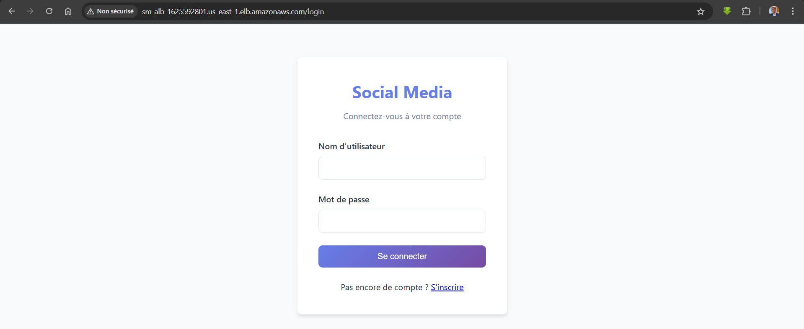

# Déploiement Spring MVC sur EC2 + ALB +RDS

## Prérequis
- EC2 Ubuntu + SG (22, 80 ouverts)
- ALB pour avoir un seul point d'entrée en cas de scalabilité horizontal
- RDS (MySQL) + SG autorisant l’EC2
- Endpoint, user, password RDS

## Étapes
1. Mise à jour & outils de base
   `sudo apt update && sudo apt upgrade -y`
   `sudo apt install -y git unzip curl`
2. Cloner le repo :
   git clone https://github.com/Sougoumay/social_media
   `cd social_media`
3. Installer OpenJDK 17
   `sudo apt install -y openjdk-17-jdk`
   `java -version`
4. Configurer la connexion DB (profil prod)
- Créer le profil prod
  `cp src/main/resources/application-docker.yml src/main/resources/application-prod.yml`
- Créer le fichier d'environnement contenant les informations de la BDD RDS (endpoint, nom de la base de données user, password) - voir l'étape 6
5. Build
   `chmod +x mvnw`
   `./mvnw -DskipTests package`
6. Créer service systemd (`/opt/springapp/app.jar`, `/etc/springapp/springapp.env`)
# Fichier d'environnement (pour secrets/params)
`sudo mkdir -p /etc/springapp`
`sudo nano /etc/springapp/springapp.env`
Le contenu de springapp.env est dans le fichier `springapp.env`

# Dossier appli + droits
`sudo mkdir -p /opt/springapp`
`sudo cp target/*.jar /opt/springapp/app.jar`
`sudo chown -R ubuntu:ubuntu /opt/springapp`

`sudo nano /etc/systemd/system/springapp.service`
Le contenu de springapp.service est dans le fichier`springapp.service`

8. Activer et demarrer le service
   `sudo systemctl daemon-reload`
   `sudo systemctl enable springapp`
   `sudo systemctl start springapp`
   `sudo systemctl status springapp --no-pager`

9. Vérifier accès via `http://<IP-EC2>:8080`

10. Installer et configurer Nginx
    `sudo apt update`
    `sudo apt install -y nginx`
    `sudo systemctl enable nginx`
    `sudo systemctl start nginx`
    `sudo nano /etc/nginx/sites-available/socialmedia`
    Le contenu de socialmedia est dans le fichier `nginx.conf`

11. Activer la configuration
    `sudo rm /etc/nginx/sites-enabled/default`
    `sudo ln -s /etc/nginx/sites-available/socialmedia /etc/nginx/sites-enabled/`
    `sudo nginx -t`
    `sudo systemctl restart nginx`

## Commandes utiles
- `journalctl -u springapp -f` # Pour suivre les logs en direct
- `sudo systemctl restart springapp`
- `sudo nginx -t`
- `sudo tail -f /var/log/nginx/access.log`
- `sudo tail -f /var/log/nginx/error.log`

