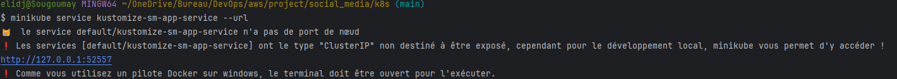
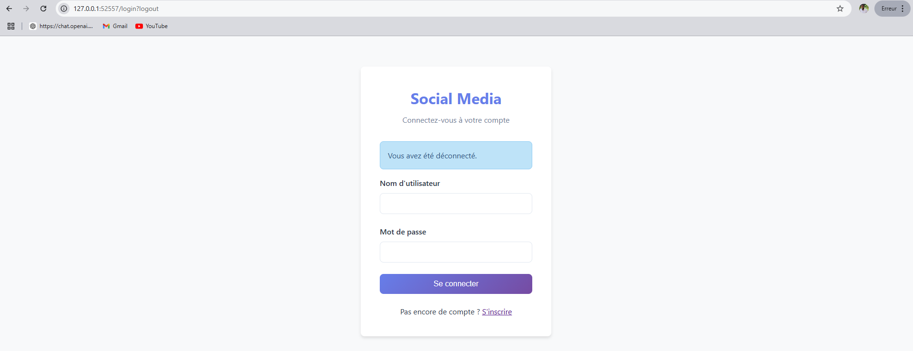
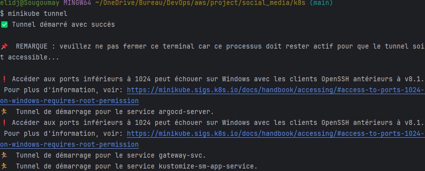

Les étapes à suivres pour lancer l'application sous kubernetes (minikube en local)

1. docker build -t sm-image .
2. minikube image load sm-image:latest
3. kubectl apply -k .
4. kubectl get svc puis copier le nom du service (très certainement kustomize-sm-app-service si tu n'as rien changé)
5. minikube service kustomize-sm-app-service --url (pour avoir un url et testé l'application en local)





- Deuxième cas : on définit le type du service de l'application à LoadBalancer. Les étapes 4 et 5 changent comme suit
- ```
    apiVersion : v1
    kind: Service
    metadata:
      name: sm-app-service
    spec:
      type: LoadBalancer
      selector:
        app: social-media
      ports:
        - port: 8080
          targetPort: 8080
  ```
4. minikube tunnel 
   
5. kubectl get svc kustomize-sm-app-service
6. $ kubectl get svc kustomize-sm-app-service
   NAME                       TYPE           CLUSTER-IP      EXTERNAL-IP   PORT(S)          AGE
   kustomize-sm-app-service   LoadBalancer   10.98.157.100   127.0.0.1     8080:30751/TCP   38m
7. Tu prend l'EXTERNAL-IP avec le port 8080 pour accéder à l'application
